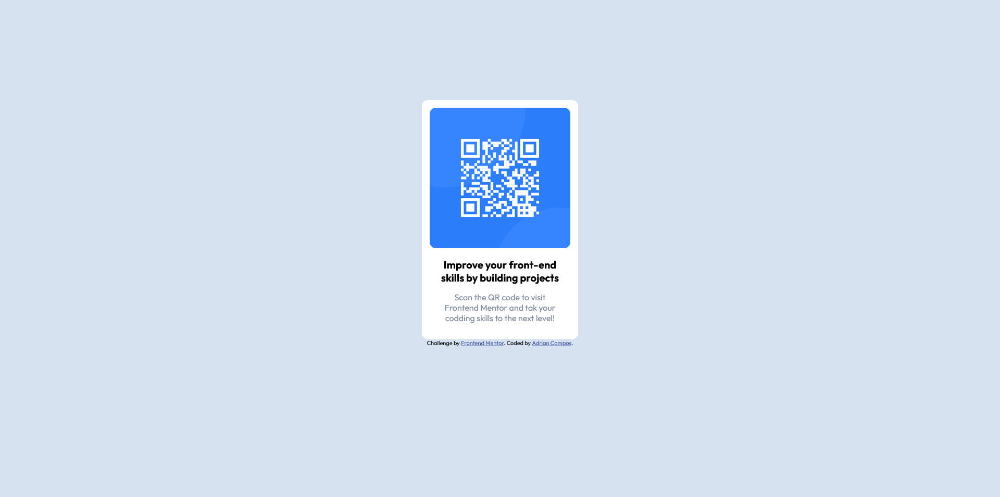

# Frontend Mentor - QR code component solution

This is a solution to the [QR code component challenge on Frontend Mentor](https://www.frontendmentor.io/challenges/qr-code-component-iux_sIO_H).

## Table of contents

- [Overview](#overview)
  - [Screenshot](#screenshot)
  - [Links](#links)
- [My process](#my-process)
  - [Built with](#built-with)
  - [What I learned](#what-i-learned)
  - [Continued development](#continued-development)
 
- [Author](#author)


**Note: Delete this note and update the table of contents based on what sections you keep.**

## Overview

### Screenshot




### Links

- Solution URL: [Github](https://github.com/jadrianc/QRFrontendMentorChallenge)
- Live Site URL: [See page](https://jadrianc.github.io/QRFrontendMentorChallenge/)

## My process

### Built with

- Semantic HTML5 markup
- CSS 


### What I learned

i learned how to import Google fonts to my projects, reinforced the concept to center a div, and the fact to base from a model and carry to code it is a great experience

Import Google fonts:

```html
  <link rel="preconnect" href="https://fonts.googleapis.com">
  <link rel="preconnect" href="https://fonts.gstatic.com" crossorigin>
  <link href="https://fonts.googleapis.com/css2?family=Outfit:wght@400;700&display=swap" rel="stylesheet">
```


### Continued development

I want to focus on responsive design, how to work with images, use javascript to put something dynamic on the page, and work with others on the same projects using GitHub and ci/cd would be great


## Author


- Frontend Mentor - [@jadrianc](https://www.frontendmentor.io/profile/jadrianc)
- Linkedin - [Adrian Campos](https://www.linkedin.com/in/jadriancamposm/)


